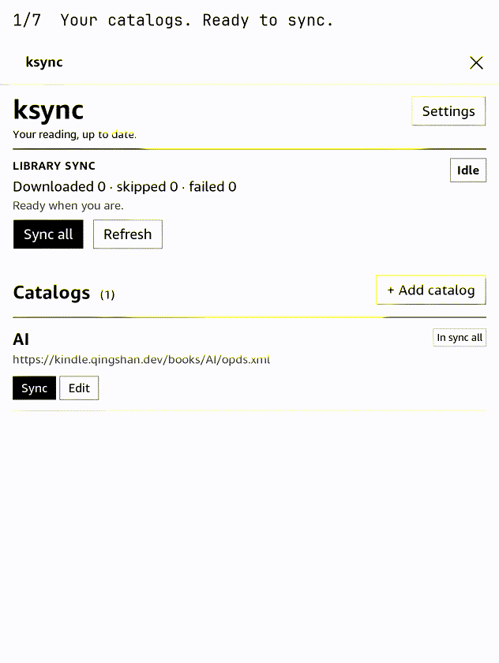

# ksync

ksync puts books from OPDS catalogs into your Kindle Library. It downloads
supported ebook files and groups them into normal Kindle collections, so you
read them from the Library alongside books sent by USB or email.

It is for a jailbroken Kindle Oasis 10th generation (`kindlehf`, firmware
5.16.x) with [KPM](https://github.com/KindleModding/KPM) installed.



The demo is captured from a real Kindle Oasis. It shows the catalog list,
Add/Edit dialogs, form validation, deletion confirmation, and collection
settings. The tour cancels changes and leaves existing catalogs and books intact.

## What you need

- A KPM-compatible, jailbroken Kindle.
- A ksync `.kpkg` built for `kindlehf`.
- An OPDS catalog URL. Authentication is supported when the catalog needs it.
- Wi-Fi while syncing.

## Install and start

Install the `.kpkg` with KPM, then open **ksync** from the Kindle Home screen.
If you use KPM's command interface, the equivalent is:

```text
;kpm install ksync
```

The first screen is the catalog list. Tap **Add catalog**, enter a name and
OPDS URL, and optionally enter the username and password. Enable **Skip TLS verification**
only for a catalog you trust that has a certificate problem.

Tap **Add catalog** in the dialog, then **Sync all**. ksync leaves the progress, current item, and
any error message on screen while it works. You may safely close the WAF; open
ksync again later to check progress.

The main page keeps daily actions together: browse three catalogs per page,
tap **Sync** for one source, or **Sync all** for included catalogs. **Stop**
appears during a sync. **Settings** and **Add catalog** open dialogs, keeping
setup out of the catalog list.

## Finding your books

Downloaded books appear in the normal Kindle Library. ksync also creates
collections named with the configured prefix (by default, `KSync`), followed by
the catalog or OPDS grouping. Open **Settings → Collection prefix** for a different
name, then tap **Apply**. **Rebuild collections** repairs collection membership
after a large sync or Library change.

ksync skips files it already has, so normal repeat syncs are safe and quick.

## Updating or moving to another catalog

Use **Edit** beside a catalog to change its URL, credentials, or TLS setting.
Uncheck **Include in sync all** to keep its saved details but sync it manually.
**Delete catalog** opens a confirmation inside the edit dialog; downloaded
books stay on the Kindle. **Cancel** returns to the catalog list without saving.

Your catalog settings live at `/mnt/us/ksync/var/catalogs.json` and are kept
when ksync is upgraded. Back up that file before resetting your Kindle.

## Troubleshooting

- `status.json missing` or a permanently checking screen: reopen ksync from
  Home. That restarts its background service.
- A catalog error: first verify its URL and credentials in a browser on another
  device. Use Skip TLS verification only when you understand the certificate warning.
- Books downloaded but collections look wrong: open **Settings → Rebuild collections** and
  give the Kindle Library a moment to refresh.
- No network: connect Wi-Fi, then run Sync all again; existing downloads are
  preserved.

## For package builders

```sh
just toolchain
just test
just package
```

`just package <version>` creates a Kindle package in `dist/`. KPM installs an
upgrade only when its version changes.

To release, bump the crate and package to the same version, run
`just package <version>`, and attach `dist/ksync_<version>_kindlehf.kpkg` to
GitHub Release `v<version>`. Then run `just publish <version>` to update the
shared KPM catalog using your local Git credentials. The publishing script
checks that the release asset exists before changing the catalog.

The release workflow can update the catalog automatically when the repository
secret `KINDLE_CATALOG_TOKEN` has write access to `qingshan/kindle`. Without
that secret it skips the update, so publish locally. The separate test workflow
runs Rust library, WAF, and browser checks on pushes and pull requests.

## Develop and test

```sh
npm ci
npx playwright install chromium
just test       # Rust library tests and the fast WAF harness
just e2e        # WAF harness plus real-browser UI tests; no Kindle needed
just demo       # host E2E tests, real-Kindle tour, and GIF/MP4 encoding
just demo-build # re-encode existing verified captures
```

The E2E entry point is `tests/e2e/ksync_e2e.py`. Browser scenarios cover paging,
sync command payloads, Add/Edit/Delete dialogs, validation, settings drafts,
focus, polling failures, and layout. They use fixture status and messaging;
they do not test real OPDS downloads or Kindle Library writes.

The device tour requires the current package installed, a working `ssh kindle`
alias, the cross compiler, Pillow, Tesseract OCR, and ffmpeg. Override the SSH
alias with `KINDLE_E2E_HOST`. Each checkpoint verifies visible text in a real
framebuffer capture; the recorder locates controls from that text and checks
that catalog configuration is unchanged. See the [E2E guide](tests/e2e/README.md)
for setup, coverage, and recording details.

## Demo artifacts

Raw captures and their verification manifest live in `target/demo/`.
`just demo` writes these shareable files under `dist/demo/`:

- `ksync-demo.gif` — captioned feature tour, also copied into `docs/` for this README.
- `ksync-demo.mp4` — video at the Kindle's native 1264×1680 resolution.
- `ksync-demo-poster.png` — opening frame.

The tour uses existing catalog names and URLs and never starts a download.
With no configured catalogs, it omits the Edit/Delete scenes.

## License

MIT. See [LICENSE](LICENSE).
